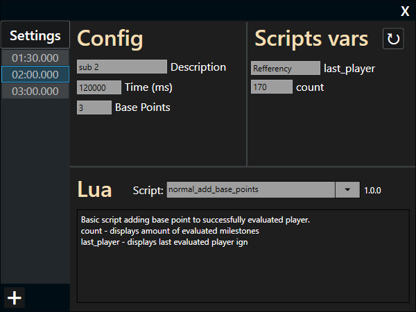

# Lua API Documentation for Tournament Tool Leaderboard Scripts

## Table of Contents
- [Introduction](#introduction)
- [Rules Edit Window Overview](#rules-edit-window-overview)
- [API Overview](#api-overview)
- [Variable Calls](#variable-calls)
    - [General Variables](#general-variables)
    - [Paceman Mode Variables](#paceman-mode-variables)
    - [Ranked Mode Variables](#ranked-mode-variables)
    - [Player Data Object](#player-data-object)
- [Method Calls](#method-calls)
- [Global Method Calls](#global-method-calls)
- [Complete Examples](#complete-examples)

## Introduction
This documentation covers the Lua API for the Tournament Tool. The API allows you to create custom scoring rules for leaderboard using Lua scripts.

### Getting Started
If you're new to Lua, we recommend:
- [Learn Lua in Y minutes](https://learnxinyminutes.com/docs/lua/) - Quick syntax overview
- [Lua 5.4 Reference Manual](https://www.lua.org/manual/5.4/) - Official documentation

### Best Practices For Leaderboard Scripts
1. Always include script metadata (`version`, `type`, `description`)
2. Register variables at the global scope (outside functions)
3. Use the `api` object to access all leaderboard API data
4. Remember that Lua arrays are 1-indexed
5. Use `print()` or `error()` statements for debugging during script development

### Script Structure
Every leaderboard script must follow this structure:

```lua
-- Script metadata
version = "1.0.0" -- Semantic versioning
type = "normal" -- or "ranked"
description = "Description of what this script does, along with an explanation of the registered custom variables"

-- Register custom variables (optional)
register_variable("variable_name", "type", default_value)

-- Main evaluation function (required)
function evaluate_data(api)
    -- Your scoring logic here
end
```

## Rules Edit Window

The following illustrations show the **Rules Editing Window**, which is a central element of the Lua scripting integration in *Tournament Tool*.  
It allows you to define, modify, and control the logic of scoring and player evaluation.

### Structure and Functionality

1. **Sub-rule list (on the left side)**
    - Sub-rules are ordered from top to bottom.
    - The order is important, since each sub-rule is evaluated sequentially – if the condition of the current one is not met, the application proceeds to the next.
    - A sub-rule is fulfilled if the player's time is below the defined threshold. Otherwise, the next sub-rule is evaluated.

2. **Milestone assignment**  
   Each rule is bound to a specific milestone, such as a *split* or an *achievement*, and applies only within that stage.

3. **Managing activity**  
   The main rule editor includes a toggle switch (*Is Enabled*) that allows you to quickly activate or deactivate the entire rule.

<p align="center">
  
</p>  
<p align="center"><em>Main rule editing panel with sub-rules list and activity toggle</em></p>

---

### Sub-rule Configuration

Each **sub-rule** is edited in a dedicated panel divided into three main sections, separated by lines:

1. **Config**
    - Defines the evaluation mode depending on the selected *controller mode*: *Paceman* or *Ranked*.
    - In *Ranked* mode, an additional parameter **Max Winners** is available. It defines the maximum number of players evaluated by the script.
        - Example: if *Max Winners* = 10, players ranked 11th and higher are automatically passed to the next sub-rule.
    - Contains the **Base Points** property – a constant point value used by the script for this sub-rule.
    - Contains **Time** threshold that defines time limit for specific sub-rule

2. **Script Vars**
    - Displays and allows editing of **custom variables**.
    - These variables are registered and handled both by the Lua script and the *Tournament Tool* itself.
    - Their values can be modified dynamically and are tied only to the given sub-rule.

3. **Lua**
    - Used to select the script attached to the sub-rule.
    - Also provides script metadata, such as description and version.

<p align="center">
  
</p>  
<p align="center"><em>Sub-rule editing panel with three configuration sections (Paceman mode)</em></p>

## API Overview
The Tournament Tool Lua API provides access to leaderboard data through an `api` object passed to the `evaluate_data` function.
The API behaves differently depending on the controller mode set in preset:
- **Normal/Paceman Mode**: Individual player scoring splits in Random Seed Glitchless category based on [paceman](https://paceman.gg/) live data
- **Ranked Mode**: Multiple player competing in [ranked](https://mcsrranked.com/) private room based on MCSR Ranked live match data api

## Variable Calls
All variables are accessed through the `api` object within the `evaluate_data` function.

### General Variables
These variables are available in both Normal and Ranked modes:

#### `api.rule_name`
- **Type**: string (read-only)
- **Description**: Returns the name of the rule
- **Example**: `local name = api.rule_name`

#### `api.rule_type`
- **Type**: string (read-only)
- **Description**: Returns the rule type ("split" or "advancement")
- **Example**: `local type = api.rule_type`

#### `api.milestone_name`
- **Type**: string (read-only)
- **Description**: Returns last part of the full name milestone from the rule
- **Example**: Minecraft Advancement `"story.enter_the_nether"` returns `"enter_the_nether"`

#### `api.description`
- **Type**: string (read-only)
- **Description**: Returns sub rule description
- **Example**: `local desc = api.description`

#### `api.time_threshold`
- **Type**: number (read-only)
- **Description**: Returns sub rule time threshold
- **Example**: `local threshold = api.time_threshold`

#### `api.base_points`
- **Type**: number (read-only)
- **Description**: Returns base points value from sub rule
- **Example**: `local base = api.base_points`

### Paceman Mode Variables
These variables are only available in Normal/Paceman mode:

#### `api.player_position`
- **Type**: number (read-only)
- **Description**: Returns current player position in leaderboard
- **Example**: `local pos = api.player_position`

#### `api.player_points`
- **Type**: number (read-only)
- **Description**: Returns total points accumulated by the player
- **Example**: `local pts = api.player_points`

#### `api.player_time`
- **Type**: number (read-only)
- **Description**: Returns player time in miliseconds for the current milestone
- **Example**: `local time = api.player_time`

#### `api.player_milestone_best_time`
- **Type**: number (read-only)
- **Description**: Returns player's best time in miliseconds for the current milestone
- **Example**: `local best = api.player_milestone_best_time`

#### `api.player_milestone_amount`
- **Type**: number (read-only)
- **Description**: Returns player's number of times the player has completed this milestone
- **Example**: `local count = api.player_milestone_amount`

#### `api.player_name`
- **Type**: string (read-only)
- **Description**: Player's in-game name in the whitelist
- **Example**: `local name = api.player_name`

### Ranked Mode Variables
These variables are only available in Ranked mode:

#### `api.round`
- **Type**: number (read-only)
- **Description**: Current round number
- **Example**: `local current_round = api.round`

#### `api.max_winners`
- **Type**: number (read-only)
- **Description**: Maximum number of winners allowed per round set in sub rule
- **Example**: `local winners = api.max_winners`

#### `api.players_in_round`
- **Type**: number (read-only)
- **Description**: Total number of active players in the current round (excludes spectators)
- **Example**: `local player_count = api.players_in_round`

#### `api.completions_in_round`
- **Type**: number (read-only)
- **Description**: Number of players who have completed the milestone in the current round
- **Example**: `local completed = api.completions_in_round`

#### `api.players`
- **Type**: array of PlayerData objects (read-only)
- **Description**: Array containing all players in the current round
- **Example**:
```lua
for i, player in ipairs(api.players) do
    -- Process each player
end
```

---

### Player Data Object
When iterating through the `api.players` array in Ranked mode, each player object contains:

#### `player.position`
- **Type**: number (read-only)
- **Description**: Player's current position on the leaderboard

#### `player.points`
- **Type**: number (read-only)
- **Description**: Player's total points on the leaderboard

#### `player.time`
- **Type**: number (read-only)
- **Description**: Player's completion time for the current milestone (in miliseconds)

#### `player.milestone_best_time`
- **Type**: number (read-only)
- **Description**: Player's best time for this milestone type (in miliseconds)

#### `player.milestone_amount`
- **Type**: number (read-only)
- **Description**: Number of times the player has completed this milestone type

#### `player.name`
- **Type**: string (read-only)
- **Description**: Player's in-game name in the whitelist

## Method Calls

### `api:register_milestone(points)` (Normal/Paceman Mode)
### `api:register_milestone(player, points)` (Ranked Mode)
- **Parameters**:
    - `points` (number): Points to award
    - `player` (PlayerData): Player object (Ranked mode only)
- **Returns**: void
- **Description**: Awards points to a player for completing a milestone
- **Example**:
```lua
-- Normal/Paceman mode
api:register_milestone(api.base_points)

-- Ranked mode
for i, player in ipairs(api.players) do
    api:register_milestone(player, api.base_points)
end
```

### `api:get_variable(name)`
- **Parameters**:
    - `name` (string): Variable name to retrieve
- **Returns**: Value of the variable (type depends on registration)
- **Description**: Retrieves the current value of a custom variable
- **Example**:
```lua
local message = api:get_variable("bonus_message")
local multiplier = api:get_variable("bonus_multiplier")
local enabled = api:get_variable("enable_bonus")
```

### `api:set_variable(name, value)`
- **Parameters**:
    - `name` (string): Variable name to update
    - `value`: New value (must match the variable's registered type)
- **Returns**: void
- **Description**: Updates the value of a custom variable
- **Example**:
```lua
api:set_variable("bonus_message", "Nice!")
api:set_variable("bonus_multiplier", 2.0)
api:set_variable("enable_bonus", false)
```

## Global Method Calls

### `register_variable(name, type, default_value)`
- **Scope**: Global (must be called outside the `evaluate_data` function)
- **Parameters**:
    - `name` (string): Variable identifier
    - `type` (string): "number", "string", or "bool"
    - `default_value`: Initial value (must match the specified type)
- **Returns**: void
- **Description**: Registers a custom variable that appears in the tournament tool's rule editor
- **Example**:
```lua
register_variable("bonus_message", "string", "Great job!")
register_variable("bonus_multiplier", "number", 1.5)
register_variable("enable_bonus", "bool", true)
```

### `print(message...)`
- **Scope**: Global (must be called outside the `evaluate_data` function)
- **Parameters**:
    - `message` (any): message value for logging purposes
- **Returns**: void
- **Description**: Logs message into tournament tool logging system (as for 0.12.0 there is no built-in console to view data)
- **Example**:
```lua
print("Succesfully evaluated!")
print("Base points = ", api.base_points)
print(i - 1, " - player: ", player.name, ", points: ", points)
```

### `error(message...)`
- **Scope**: Global (must be called outside the `evaluate_data` function)
- **Parameters**:
    - `message` (any): message value for error logging purposes
- **Returns**: void
- **Description**: Logs error message into tournament tool logging system visible in notification panel available through bell button in bottom status bar
- **Example**:
```lua
error("Error here!")
error(i - 1, " - player: ", player.name, ", points: ", points)
```


## Complete Examples

### Normal/Paceman Mode Example
```lua
version = "1.0.0"
type = "normal"
description = "Basic script adding base point to successfully evaluated player.\ncount - displays amount of evaluated milestones\nlast_player - displays last evaluated player ign"

register_variable("count", "number", 0)
register_variable("last_player", "string", "none")

function evaluate_data(api)
    api:set_variable("count", api:get_variable("count") + 1)
    api:set_variable("last_player", api.player_name)

    api:register_milestone(api.base_points)
end
```

### Ranked Mode Example
```lua
version = "1.0.0"
type = "ranked"
description = "Basic Ranked type script adding base point to all evaluated players.\namount_players_evaluated - displays amount of players evaluated last round"

register_variable("amount_players_evaluated", "number", 0)

function evaluate_data(api)
    api:set_variable("amount_players_evaluated", #api.players)

    for _, player in ipairs(api.players) do
        api:register_milestone(player, api.base_points)
    end
end
```

### Ranked Mode Advanced Example
```lua
version = "2.0.0"
type = "ranked"
description = "Points evaluation based on showdown/lcq points distribution.\nplayers_amount - last number of players evaluated by the script"

register_variable("players_amount", "number", 0)

function evaluate_data(api)
    api:set_variable("playersAmount", #api.players)

    print("Evaluation for: ", api.milestone_name)
    print("==================================================================")
    for i, player in ipairs(api.players) do
        local points = round((#api.players - (i - 1)) / #api.players * api.base_points)
        print(i - 1, " - player: ", player.name, ", points: ", points)

        api:register_milestone(player, points)
    end
    print("==================================================================")
end

function round(x)
    return math.floor(x + 0.5)
end
```