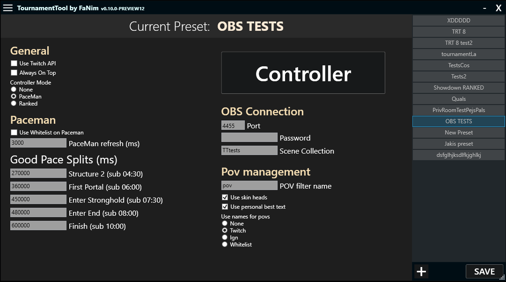

# MCSR Tournament Tool  

**MCSR Tournament Tool** is a desktop application designed to streamline the management of Points of View (POVs) in OBS during **Minecraft Speedrunning** tournaments. This tool is tailored for streamers and tournament organizers, providing a wide range of features to simplify configuration and enhance gameplay monitoring.  

## Key Features  

- **Create and Manage Presets**  
  Easily configure different modes for the application, such as:  
  - **None** – basic mode without external data integration.  
  - **Paceman** – integration with [Paceman.gg](https://paceman.gg) to display current player paces along with splits.  
  - **Ranked** – support for private MCSR Ranked rooms with automatic adjustments based on the game mode in the preset.  

- **Whitelist Management**  
  Manage a custom list of players to include in Points of View (POVs).  

- **Dynamic OBS POV Management**  
  Effortlessly switch between player views with built-in POV management features.  

## Planned Enhancements  

- Support for displaying player data from MCSR Ranked and Paceman.  
- Automated processes for creating and managing POVs in OBS.  
- A more detailed API to display additional information in OBS for viewers.  

## How to Get Started (Detailed tutorial in future)

1. Download the application from the [GitHub repository](https://github.com/FaNim21/TournamentTool/releases).  
2. Configure initial settings for OBS, such as scene items and WebSocket connections, and add players to the whitelist.  
3. Select the desired preset and start your tournament!  
