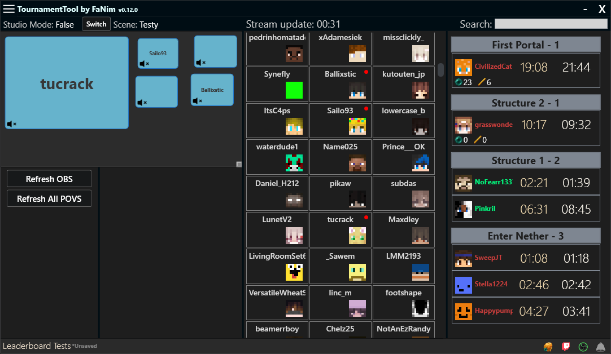

# MCSR Tournament Tool  

**MCSR Tournament Tool** is a desktop application designed to streamline the management of Points of View (POVs) in OBS during **Minecraft Speedrunning** tournaments. This tool is tailored for streamers and tournament organizers, providing a wide range of features to simplify configuration and enhance gameplay monitoring.

  

  

<em>Start app view as preset menu (view is WIP)</em>

  

  

<em>Whitelist menu view</em>

  

  

<em>Controller menu view with controller mode for Paceman (view is WIP)</em>

  

  

<em>Leaderboard menu view with visible rules and evaluated players</em>

## Key Features  

- **Create and Manage Presets**  
  Easily configure different modes for the application, such as:  
  - **None** – basic mode without external data integration.  
  - **Paceman** – integration with [Paceman.gg](https://paceman.gg) to display current player paces along with splits.  
  - **Ranked** – support for private MCSR Ranked rooms with API integrations for obs and live pace display for players in the room.  

- **Whitelist Management**  
  Manage a custom list of players to include in Points of View (POVs).  

- **Dynamic OBS POV Management**  
  Effortlessly switch between player views with built-in POV management features using drag-and-drop functionality or by directly clicking on players and POVs.

- **Leaderboard**  
  Track player progress in real time with milestones, points, and custom scoring rules. Easily view best times, averages, and other performance statistics.
## Planned Enhancements  

- Support for displaying player statistics from MCSR Ranked and Paceman.
- Automated processes for creating and managing POVs in OBS.
- A more detailed API to display additional information to OBS for viewers.
- Video and documentation tutorial.

## How to Get Started (Detailed tutorial in future)

1. Download the application from the [GitHub repository](https://github.com/FaNim21/TournamentTool/releases).  
2. Configure initial settings for OBS, such as scene items and WebSocket connections, and add players to the whitelist.  
3. Select the desired preset and start your tournament!

For support or inquiries, feel free to reach out via Discord: FaNim#fanim

## Thanks to:
- Automatt for ideas and motivation
- Hinxer for help with UI design
